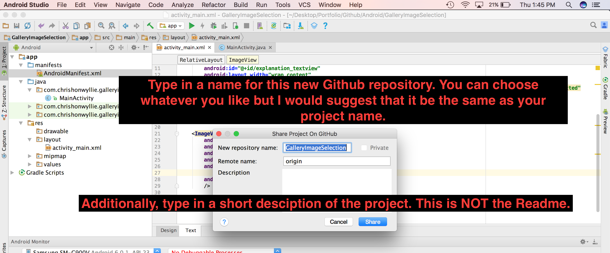

# Android-HowToUploadToGithub
Screenshots explaining how to upload an Android Studio project to Github

 
 

<h4>Step one</h4>

 
 
 

<h4>Step two</h4>

 
 
 

<h4>Step three</h4>

 
 
 

<h4>Step four</h4>

 
 
 

<h4>Step five</h4>

 
 
 

<h4>Step six</h4>

 
 
 
